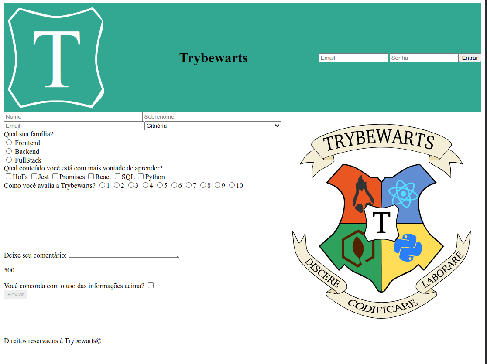

# Trybe-Project-04-Trybewarts

Project developed in the web fundamentals module at trybe

## Description

In this project, a form page for the Trybewarts School of Magic was developed, where students can send their feedback about it. The theme of this project is based on the book 'Harry Potter', by J. K. Rowling.

## Skills developed

- Create forms in HTML
- Use CSS Flexbox to create flexible layouts
- Build pages that change their layout according to screen orientation

## Preview

